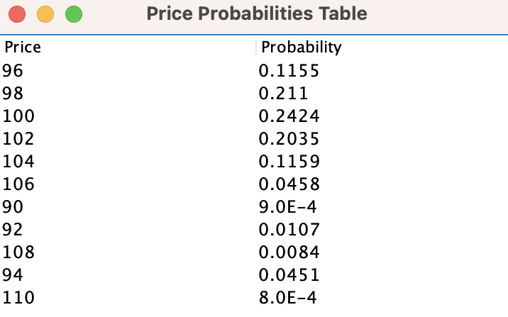

<html>
</head>
    <h1>Monte Carlo Simulation - Readme</h1>
    <h2>Description</h2>
    
This Java application performs a Monte Carlo simulation to calculate the probabilities of different share prices after a series of steps. It takes user input for the number of steps (S) and the number of walks (N) and simulates share price changes. The application then displays a probability distribution table.

    <h2>How to Run</h2>
    <ol>
        <li>Ensure you have JDK@17 installed on your system.</li>
        <li>Compile the Java code using the following command from inside this repository:</li>
        <pre><code>javac monte_carlo/src/main/java/com/monte_carlo/App.java</code></pre>
        <li>Run the application with the following command from inside this repository:</li>
        <pre><code>java monte_carlo/src/main/java/com/monte_carlo/App.java</code></pre>
        <li>Follow the on-screen instructions to enter values for S and N when prompted.</li>
        <li>The application will display the probability distribution table in a pop-up window.</li>
        <li>If the number of steps (S) is even, it will also display the probability of the price returning to 100 after 10 steps.</li>
    </ol>
    <h2>Sample Output</h2>
    <pre><code>
    Enter a value for S (number of steps) (1-100): 10
    Enter a value for N (number of walks) (1-100000): 10000
    Probability of price equal to 100 after 10 steps = 0.0005
    </code></pre>
    
Probability :

    
    <h2>About the Code</h2>
    
The code uses a Monte Carlo simulation to estimate the probabilities of share prices after a series of random steps. It includes methods for simulation, probability calculation, and a graphical display.

    <h2>Author</h2>
    
Author: Your Name

    <h2>License</h2>
    
This project is licensed under the MIT License - see the <a href="LICENSE">LICENSE</a> file for details.

</html>
