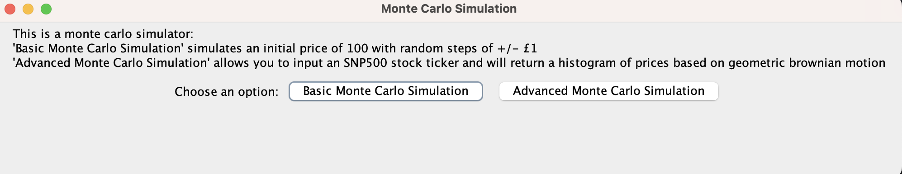
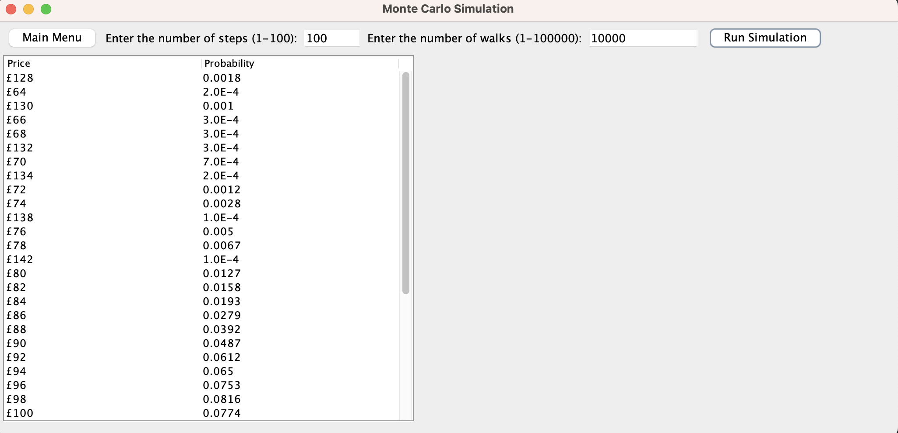
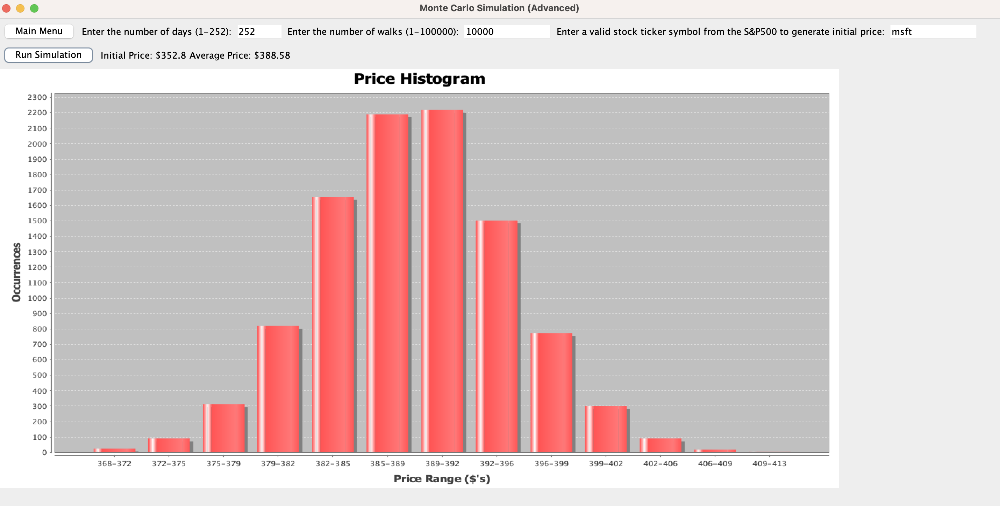

<html>
    <h1>Monte Carlo Simulation - Readme</h1>
    <h2>Description</h2>
        
This Java application performs a Monte Carlo simulation to calculate the probabilities of different share prices after a series of steps. It takes user input for the number of steps (S) and the number of walks (N) and simulates share price changes. This application has two different models, basic, and advanced. Basic applies +/- £1 randomly to an initial price of £100 with each step. Advanced applies geometric brownian motion to an initial share price over a number of days, the share price is called via API from finnhub.io.

    <h2>Downloads</h2>
        <h3> Maven (Not necessary to run) </h3>
        <li><a href="https://maven.apache.org/install.html" >Ensure you have Maven installed on your system.</a></li>
        <li>Alternatively use: <code>brew install maven</code>   </li>
        <h3> Java </h3>
        <li><a href="https://www.oracle.com/uk/java/technologies/downloads/" >Ensure you have JDK@17 installed on your system.</a></li>
        <li>Alternatively use: <code>brew install openjdk@17</code>   </li>
    <h3>How to Run </h3>
        <li>Run the application with the following commands from inside the repository:</li>  
        <pre><code>cd monte_carlo</code></pre>
        <pre><code>java -jar target/monte_carlo-MAJOR-jar-with-dependencies.jar</code></pre>
        <li>Follow the on-screen instructions to choose either a standard or an advanced simulation</li>
    <h2>Sample Output</h2>
    <h3>Menu</h3>
        
    <h3>Basic</h3>
        
     <h3>Advanced</h3>
        
     <h3>How to Test </h3>
        <pre><code>cd monte_carlo</code></pre>
        <pre><code>mvn test</code></pre>
    <h2>Author</h2>
        
Author: James McLeish

</html>
